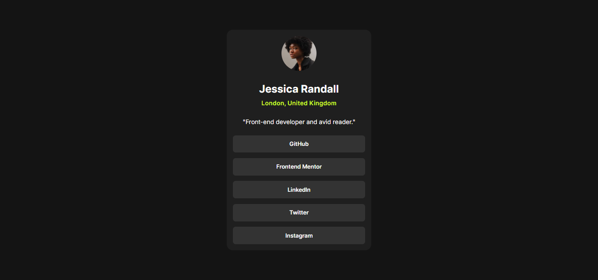
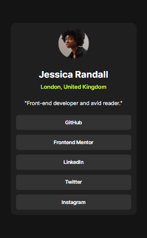

# Social Links Profile 🎭  

A simple and responsive social links profile page built using **HTML & CSS**, inspired by a Frontend Mentor challenge. This project showcases a personal profile with social media links, designed with a modern and minimalistic aesthetic.

## 🚀 Live Demo  
🔗 [View Project](https://bhavikthakur.github.io/social-links-profile/)  

## 📸 Preview  
  
  
  

## 📌 Features  
✔️ Fully responsive design  
✔️ Modern and accessible UI  
✔️ Smooth hover effects  
✔️ Minimalist dark-themed layout  

## 🛠️ Built With  
- **HTML5**    <br>
- **CSS3 (Flexbox, Responsive Design)**    <br>
- **Google Fonts (Inter)**    <br>

## 📂 Folder Structure  
📁 social-links-profile <br>
│── 📁 assets  <br>
│ ├── 📁 images  <br>
│ │ ├── avatar-jessica.jpeg  <br>
│ │ ├── favicon-32x32.png  <br>
│── 📁 css  <br>
│ ├── styles.css  <br>
│── index.html <br>


## 🔧 Setup & Usage  
1. Clone this repository:  
   ```bash
   git clone https://github.com/bhavikthakur/social-links-profile.git   
2. Open index.html in your browser. 

## 🔓 Lessons Learned  
Improved layout structuring with CSS Flexbox. <br>
Created a fully responsive design for different screen sizes.  <br>
Enhanced accessibility using proper semantic HTML.  <br>


## 🤝 Connect With Me  
👨‍💻 GitHub: [bhavikthakur](https://github.com/bhavikthakur)  <br>
💼 LinkedIn: [Bhavik Thakur](https://www.linkedin.com/in/bhavik-thakur/)  <br>
🐦 Twitter: [Bhavik Thakur](https://x.com/BhavikkThakur)  <br>


